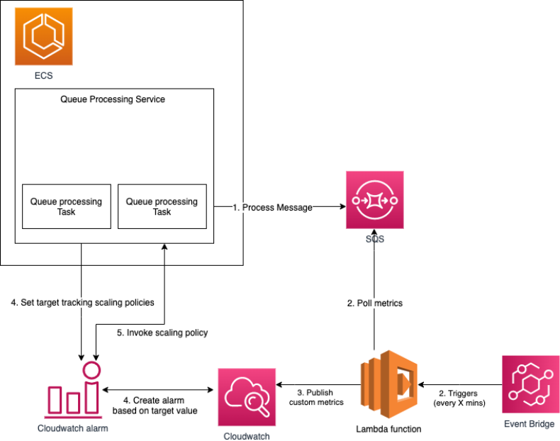

# ⚙️ ECS / SQS TargetTracking Scaling using custom metrics

### 📖  Docs
- Terraform docs ➡️  [./docs/README_TF.md](./docs/README_TF.md)
- AWS Javascript SDKv3  ➡️  https://docs.aws.amazon.com/AWSJavaScriptSDK/v3/latest/
- AWS docs architecture references ➡️  [aws-ref1](https://aws.amazon.com/blogs/containers/amazon-elastic-container-service-ecs-auto-scaling-using-custom-metrics/) 
/ [aws-ref2](https://docs.aws.amazon.com/autoscaling/ec2/userguide/as-using-sqs-queue.html) 
/ [aws-ref3](https://aws.amazon.com/blogs/compute/scaling-an-asg-using-target-tracking-with-a-dynamic-sqs-target/) 
/ [aws-target-tracking-ref](https://docs.aws.amazon.com/autoscaling/ec2/userguide/as-scaling-target-tracking.html)

---

